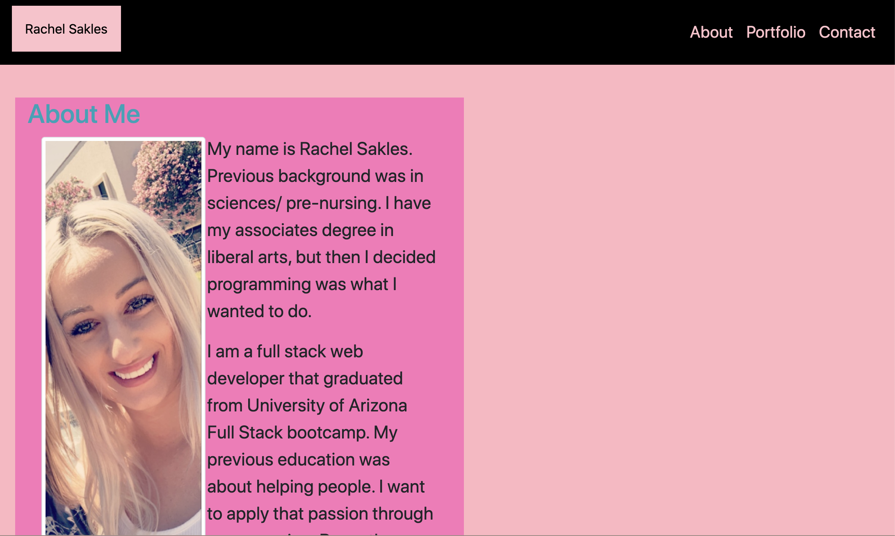

# Responsive-Portfolio 
I created a responsive portfolio. It will allow the user to view each page on different sized screens. Everything will stay consistent through each html page.  

I was able to style it with some of my favorite colors

DEPLOYED URL: https://rachelsakles.github.io/Responsive-Portfolio/ 

UPDATE: I made some changes that include an alert, that alerts the user if they submit their contact info. I also created a function that passes through an array of random facts about me. Finally, I added some of my homeworks/projects to my portfolio. 

;